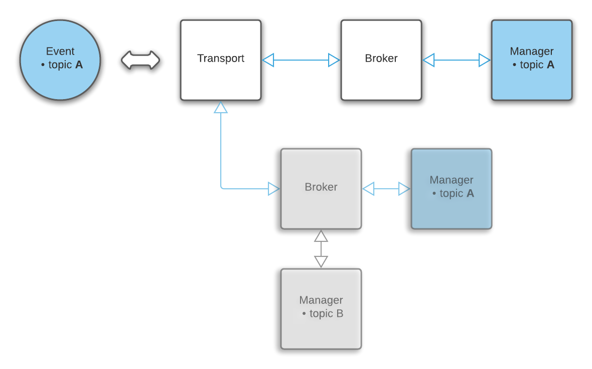

### Minimalistic bidirectional event broker for Dart.

# Introduction

This package helps building event-driven systems by providing a small set of components: 

**Transport**, **Broker**, **Manager**, **Event**.

Designed for full modularity and easy integration they can be combined to **create topologies** of any shape and complexity. 

Either via **static** or **dynamic configuration** runtime. 

**Bidirectional** communication between transport and managers is supported out of the box. 

# Example topology



# API at a glance

```dart
class TopicEvent 
  String topic // identifier
  String cmd
  dynamic payload

abstract class TopicManager
  String get topic // event destination
  handleEvent(TopicEvent) // consume incoming event
  sendEvent(TopicEvent) // produce outgoing event


abstract class TopicEventTransport
  onReceive(TopicEvent) // forward to broker
  onSend(TopicEvent) // receive from broker


class TopicEventBroker
  addManager(TopicManager)
  setTransport(TopicEventTransport)

```

# Usage

Set up the transport:

```dart
class MySocket extends TopicEventTransport {
  void connect() =>
      // BYO event source (sync or async)
      // call *onReceive* to forward incoming events to the broker
      myEventStream.listen(onReceive);

  // must override to handle outgoing events
  @override
  void onSend(TopicEvent event) => myEventSink.add(event);
}
```

Define one or more  managers:

```dart
class MyManager extends TopicManager {
  // override to set the topic identifier
  @override
  Topic get topic => 'my_topic';

  // override to handle incoming events
  @override
  void handleEvent(TopicEvent event) {
    // do something with the event
    // call *sendEvent* to trigger outgoing my_topic events
    sendEvent('add', 'some data');
  }
}
```

Pass the transport and managers to the broker:

```dart
final socket = MySocket();

TopicEventBroker()
  // add as many managers as you need
  // adding a manager for an existing topic will replace the existing manager
  ..addManager(MyManager())
  ..addManager(MyOtherManager())
  // a broker can only have one transport at a time
  // on the other hand, a transport can handle multiple brokers, broadcasting incoming events
  // calling *setTransport* repeatedly will replace the existing transport and deregister the broker from it  
  ..setTransport(socket);

socket.connect();
socket.myEvents.add(TopicEvent('my_topic', 'do', 'something')); // -> MyManager
socket.myEvents.add(TopicEvent('my_other_topic', 'show', '{"arbitrary": "data"}')); // -> MyOtherManager
```